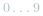
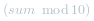
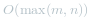
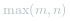
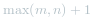
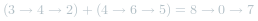

#### 方法：初等数学

**思路**

我们使用变量来跟踪进位，并从包含最低有效位的表头开始模拟逐位相加的过程。

 [Add Two Numbers](https://pic.leetcode-cn.com/Figures/2/2_add_two_numbers.svg)


*图1，对两数相加方法的可视化: *342 + 465 = 807*，每个结点都包含一个数字，并且数字按位逆序存储。*


**算法**

就像你在纸上计算两个数字的和那样，我们首先从最低有效位也就是列表 *l1* 和 *l2* 的表头开始相加。由于每位数字都应当处于   的范围内，我们计算两个数字的和时可能会出现 “溢出”。例如，*5 + 7 = 12*。在这种情况下，我们会将当前位的数值设置为 *2*，并将进位 *carry = 1* 带入下一次迭代。进位 *carry* 必定是 *0* 或 *1*，这是因为两个数字相加（考虑到进位）可能出现的最大和为 *9 + 9 + 1 = 19*。

伪代码如下：

* 将当前结点初始化为返回列表的哑结点。
* 将进位 *carry* 初始化为 *0*。
* 将 *p* 和 *q* 分别初始化为列表 *l1* 和 *l2* 的头部。
* 遍历列表 *l1* 和 *l2* 直至到达它们的尾端。
    * 将 *x* 设为结点 *p* 的值。如果 *p* 已经到达 *l1* 的末尾，则将其值设置为 *0*。
    * 将 *y* 设为结点 *q* 的值。如果 *q* 已经到达 *l2* 的末尾，则将其值设置为 *0*。
    * 设定 *sum = x + y + carry*。
    * 更新进位的值，*carry = sum / 10*。
    * 创建一个数值为   的新结点，并将其设置为当前结点的下一个结点，然后将当前结点前进到下一个结点。
    * 同时，将 *p* 和 *q* 前进到下一个结点。
* 检查 *carry = 1* 是否成立，如果成立，则向返回列表追加一个含有数字 *1* 的新结点。
* 返回哑结点的下一个结点。

请注意，我们使用哑结点来简化代码。如果没有哑结点，则必须编写额外的条件语句来初始化表头的值。

请特别注意以下情况：

| 测试用例 | 说明 |
| ------------- | ---------------- |
| *l1=[0,1]*，*l2=[0,1,2]* | 当一个列表比另一个列表长时 |
| *l1=[]*，*l2=[0,1]* | 当一个列表为空时，即出现空列表 |
| *l1=[9,9]*，*l2=[1]* | 求和运算最后可能出现额外的进位，这一点很容易被遗忘 |


```java [3M7ufcbi-Java]
public ListNode addTwoNumbers(ListNode l1, ListNode l2) {
    ListNode dummyHead = new ListNode(0);
    ListNode p = l1, q = l2, curr = dummyHead;
    int carry = 0;
    while (p != null || q != null) {
        int x = (p != null) ? p.val : 0;
        int y = (q != null) ? q.val : 0;
        int sum = carry + x + y;
        carry = sum / 10;
        curr.next = new ListNode(sum % 10);
        curr = curr.next;
        if (p != null) p = p.next;
        if (q != null) q = q.next;
    }
    if (carry > 0) {
        curr.next = new ListNode(carry);
    }
    return dummyHead.next;
}
```


**复杂度分析**

* 时间复杂度： ，假设 *m* 和 *n* 分别表示 *l1* 和 *l2* 的长度，上面的算法最多重复   次。

* 空间复杂度： ， 新列表的长度最多为  。

**拓展**

如果链表中的数字不是按逆序存储的呢？例如：

 